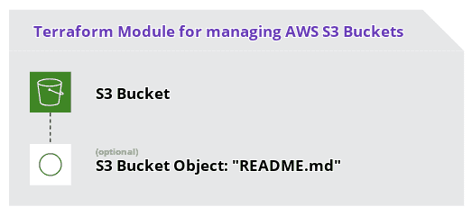

# Terraform Module: AWS S3 Bucket

> Terraform Module for managing AWS [S3 Buckets](https://docs.aws.amazon.com/AmazonS3/latest/dev/UsingBucket.html).

## Table of Contents

- [Terraform Module: AWS S3 Bucket DNS Records](#terraform-module-aws-s3-bucket-dns-records)
  - [Table of Contents](#table-of-contents)
  - [Overview](#overview)
  - [Requirements](#requirements)
  - [Dependencies](#dependencies)
  - [Usage](#usage)
    - [Inputs](#inputs)
    - [Outputs](#outputs)
  - [Author Information](#author-information)
  - [License](#license)

## Overview



## Requirements

This module requires Terraform version `0.13.0` or newer.

## Dependencies

This module depends on a correctly configured [AWS Provider](https://www.terraform.io/docs/providers/aws/index.html) in your Terraform codebase.

## Usage

Add the module to your Terraform resources like so:

```hcl
module "simple_example" {
  source  = "operatehappy/s3-bucket/aws"
  version = "1.1.4"

  name = "oh-demo-simple-example"

  tags = {
    Department = "Operations"
  }

  force_destroy = true

  create_readme = false
}
```

Then, fetch the module from the [Terraform Registry](https://registry.terraform.io/modules/operatehappy/s3-bucket) using `terraform get`.

Additional usage examples are available in the `examples` directory via [GitHub](https://github.com/operatehappy/terraform-aws-s3-bucket/tree/master/examples).

### Inputs

| Name | Description | Type | Default |
|------|-------------|------|---------|
| acceleration_status | Acceleration Status of S3 Bucket | `string` | n/a |
| name | Name of S3 Bucket | `string` | n/a |
| policy | Policy (JSON) Document of S3 Bucket | `string` | n/a |
| region | Region of S3 Bucket | `string` | n/a |
| acl | Canned ACL of S3 Bucket | `string` | `"private"` |
| cors_rule | Map of CORS Rules of S3 Bucket | `any` | `{}` |
| create_readme | Toggle creation of `README.md` in root of S3 Bucket | `bool` | `true` |
| force_destroy | Toggle to enable force-destruction of S3 Bucket | `bool` | `false` |
| lifecycle_rule | Map of Lifecycle Rule configuration of S3 Bucket | `list` | `[]` |
| logging | Map of Logging configuration of S3 Bucket | `map(string)` | `{}` |
| object_lock_configuration | Object-lock Configuration of S3 Bucket | `any` | `{}` |
| readme_additions | Additional content (e.g.: information, instructions) to add to README.md | `string` | `""` |
| request_payer | Identifier for Request Cost-allocation of S3 Bucket | `string` | `"BucketOwner"` |
| server_side_encryption_configuration | Server-side Encryption (SSE) Configuration of S3 Bucket | `map` | `{}` |
| tags | Mapping of Tags of S3 Bucket | `map` | `{}` |
| use_default_tags | Toggle to enable creation of default tags, containing Terraform Workspace identifier | `bool` | `true` |
| use_prefix | Toggle to use randomly-generated Prefix for Bucket Name | `bool` | `false` |
| versioning | Map of Versionining configuration of S3 Bucket | `map(string)` | `{}` |
| website | Map of Website configuration of S3 Bucket | `map(string)` | `{}` |

### Outputs

| Name | Description |
|------|-------------|
| arn | ARN of the Bucket |
| bucket_domain_name | Domain name of the Bucket |
| bucket_regional_domain_name | Region-specific domain name of the Bucket |
| hosted_zone_id | Hosted Zone ID of the Bucket's Region |
| id | Name of the Bucket |
| readme_etag | ETag of the README file |
| readme_id | Key of the README file |
| readme_version_id | Version ID of the README file |
| region | Region of the Bucket |
| website_domain | Domain of the Website Endpoint of the Bucket |
| website_endpoint | Website Endpoint of the Bucket |

## Author Information

This module is maintained by the contributors listed on [GitHub](https://github.com/operatehappy/terraform-aws-s3-bucket/graphs/contributors).

Development of this module was sponsored by [Operate Happy](https://github.com/operatehappy).

## License

Licensed under the Apache License, Version 2.0 (the "License").

You may obtain a copy of the License at [apache.org/licenses/LICENSE-2.0](http://www.apache.org/licenses/LICENSE-2.0).

Unless required by applicable law or agreed to in writing, software distributed under the License is distributed on an _"AS IS"_ basis, without WARRANTIES or conditions of any kind, either express or implied.

See the License for the specific language governing permissions and limitations under the License.
